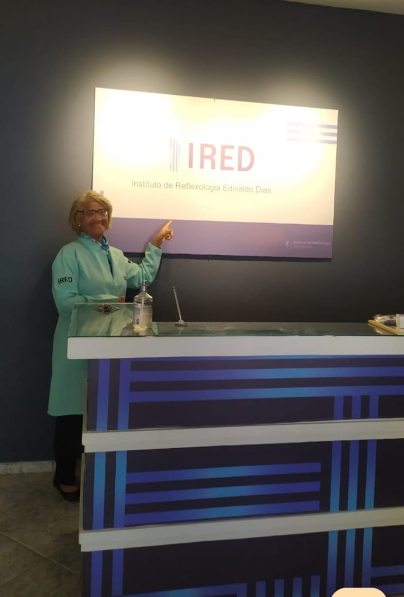

# 🎁 Recursos Extras - JV Beleza & Estética

## 📱 Adicionar Links de Redes Sociais

### Instagram
Adicione no footer do `index.html` (após linha 630):

```html
<div class="footer-column">
    <h4 class="footer-heading">Redes Sociais</h4>
    <div class="social-links">
        <a href="https://instagram.com/jvbelezaestetica" target="_blank" rel="noopener noreferrer" class="social-link">
            <svg xmlns="http://www.w3.org/2000/svg" width="24" height="24" viewBox="0 0 24 24" fill="currentColor">
                <path d="M12 2.163c3.204 0 3.584.012 4.85.07 3.252.148 4.771 1.691 4.919 4.919.058 1.265.069 1.645.069 4.849 0 3.205-.012 3.584-.069 4.849-.149 3.225-1.664 4.771-4.919 4.919-1.266.058-1.644.07-4.85.07-3.204 0-3.584-.012-4.849-.07-3.26-.149-4.771-1.699-4.919-4.92-.058-1.265-.07-1.644-.07-4.849 0-3.204.013-3.583.07-4.849.149-3.227 1.664-4.771 4.919-4.919 1.266-.057 1.645-.069 4.849-.069zm0-2.163c-3.259 0-3.667.014-4.947.072-4.358.2-6.78 2.618-6.98 6.98-.059 1.281-.073 1.689-.073 4.948 0 3.259.014 3.668.072 4.948.2 4.358 2.618 6.78 6.98 6.98 1.281.058 1.689.072 4.948.072 3.259 0 3.668-.014 4.948-.072 4.354-.2 6.782-2.618 6.979-6.98.059-1.28.073-1.689.073-4.948 0-3.259-.014-3.667-.072-4.947-.196-4.354-2.617-6.78-6.979-6.98-1.281-.059-1.69-.073-4.949-.073zm0 5.838c-3.403 0-6.162 2.759-6.162 6.162s2.759 6.163 6.162 6.163 6.162-2.759 6.162-6.163c0-3.403-2.759-6.162-6.162-6.162zm0 10.162c-2.209 0-4-1.79-4-4 0-2.209 1.791-4 4-4s4 1.791 4 4c0 2.21-1.791 4-4 4zm6.406-11.845c-.796 0-1.441.645-1.441 1.44s.645 1.44 1.441 1.44c.795 0 1.439-.645 1.439-1.44s-.644-1.44-1.439-1.44z"/>
            </svg>
        </a>
        <a href="https://facebook.com/jvbelezaestetica" target="_blank" rel="noopener noreferrer" class="social-link">
            <svg xmlns="http://www.w3.org/2000/svg" width="24" height="24" viewBox="0 0 24 24" fill="currentColor">
                <path d="M24 12.073c0-6.627-5.373-12-12-12s-12 5.373-12 12c0 5.99 4.388 10.954 10.125 11.854v-8.385H7.078v-3.47h3.047V9.43c0-3.007 1.792-4.669 4.533-4.669 1.312 0 2.686.235 2.686.235v2.953H15.83c-1.491 0-1.956.925-1.956 1.874v2.25h3.328l-.532 3.47h-2.796v8.385C19.612 23.027 24 18.062 24 12.073z"/>
            </svg>
        </a>
    </div>
</div>
```

Adicione o CSS no `css/style.css` (no final):

```css
/* Social Links */
.social-links {
    display: flex;
    gap: var(--spacing-md);
    margin-top: var(--spacing-sm);
}

.social-link {
    width: 40px;
    height: 40px;
    display: flex;
    align-items: center;
    justify-content: center;
    background: rgba(255, 255, 255, 0.1);
    border-radius: 50%;
    color: var(--text-white);
    transition: all var(--transition-normal);
}

.social-link:hover {
    background: var(--primary-gold);
    transform: translateY(-4px);
}
```

---

## 🖼️ Adicionar Galeria de Fotos

Adicione uma nova seção antes do contato no `index.html`:

```html
<!-- ==================== GALLERY SECTION ==================== -->
<section class="section section-gallery" id="galeria">
    <div class="container">
        <div class="section-header fade-in">
            <h2 class="section-title">Nossa Galeria</h2>
            <div class="section-divider"></div>
            <p class="section-subtitle">Conheça nosso espaço e nossos trabalhos</p>
        </div>

        <div class="gallery-grid">
            <div class="gallery-item fade-in">
                
            </div>
            <div class="gallery-item fade-in">
                
            </div>
            <div class="gallery-item fade-in">
                
            </div>
            <div class="gallery-item fade-in">
                
            </div>
            <div class="gallery-item fade-in">
                
            </div>
            <div class="gallery-item fade-in">
                
            </div>
        </div>
    </div>
</section>
```

CSS para a galeria:

```css
/* Gallery Section */
.section-gallery {
    background: var(--bg-light);
}

.gallery-grid {
    display: grid;
    grid-template-columns: repeat(auto-fit, minmax(300px, 1fr));
    gap: var(--spacing-md);
}

.gallery-item {
    position: relative;
    overflow: hidden;
    border-radius: var(--radius-lg);
    box-shadow: var(--shadow-sm);
    cursor: pointer;
    aspect-ratio: 1 / 1;
}

.gallery-item img {
    width: 100%;
    height: 100%;
    object-fit: cover;
    transition: transform var(--transition-slow);
}

.gallery-item:hover img {
    transform: scale(1.1);
}

.gallery-item::after {
    content: '';
    position: absolute;
    top: 0;
    left: 0;
    width: 100%;
    height: 100%;
    background: linear-gradient(135deg, rgba(212, 165, 116, 0.8), rgba(232, 160, 128, 0.8));
    opacity: 0;
    transition: opacity var(--transition-normal);
}

.gallery-item:hover::after {
    opacity: 0.9;
}
```

---

## 💬 Adicionar Seção de Depoimentos

```html
<!-- ==================== TESTIMONIALS SECTION ==================== -->
<section class="section section-testimonials" id="depoimentos">
    <div class="container">
        <div class="section-header fade-in">
            <h2 class="section-title">O Que Nossos Clientes Dizem</h2>
            <div class="section-divider"></div>
        </div>

        <div class="testimonials-grid">
            <div class="testimonial-card fade-in">
                <div class="testimonial-stars">⭐⭐⭐⭐⭐</div>
                <p class="testimonial-text">"Excelente atendimento! A drenagem linfática é maravilhosa e o ambiente é super acolhedor."</p>
                <div class="testimonial-author">
                    <div class="author-avatar">
                        
                    </div>
                    <div class="author-info">
                        <h4 class="author-name">Maria Silva</h4>
                        <p class="author-service">Drenagem Linfática</p>
                    </div>
                </div>
            </div>

            <div class="testimonial-card fade-in">
                <div class="testimonial-stars">⭐⭐⭐⭐⭐</div>
                <p class="testimonial-text">"O botox capilar ficou perfeito! Meu cabelo nunca esteve tão saudável e brilhante."</p>
                <div class="testimonial-author">
                    <div class="author-avatar">
                        
                    </div>
                    <div class="author-info">
                        <h4 class="author-name">Ana Costa</h4>
                        <p class="author-service">Botox Capilar</p>
                    </div>
                </div>
            </div>

            <div class="testimonial-card fade-in">
                <div class="testimonial-stars">⭐⭐⭐⭐⭐</div>
                <p class="testimonial-text">"Profissionais super capacitados e atenciosos. Recomendo muito!"</p>
                <div class="testimonial-author">
                    <div class="author-avatar">
                        
                    </div>
                    <div class="author-info">
                        <h4 class="author-name">Júlia Santos</h4>
                        <p class="author-service">Massagem Relaxante</p>
                    </div>
                </div>
            </div>
        </div>
    </div>
</section>
```

CSS:

```css
/* Testimonials Section */
.section-testimonials {
    background: linear-gradient(135deg, var(--primary-brown), #4a2e17);
    color: var(--text-white);
}

.section-testimonials .section-title {
    color: var(--text-white);
}

.testimonials-grid {
    display: grid;
    grid-template-columns: repeat(auto-fit, minmax(300px, 1fr));
    gap: var(--spacing-lg);
}

.testimonial-card {
    background: rgba(255, 255, 255, 0.1);
    backdrop-filter: blur(10px);
    padding: var(--spacing-lg);
    border-radius: var(--radius-xl);
    border: 1px solid rgba(255, 255, 255, 0.2);
}

.testimonial-stars {
    font-size: 1.5rem;
    margin-bottom: var(--spacing-sm);
}

.testimonial-text {
    font-size: 1rem;
    line-height: 1.6;
    margin-bottom: var(--spacing-md);
    font-style: italic;
}

.testimonial-author {
    display: flex;
    align-items: center;
    gap: var(--spacing-sm);
}

.author-avatar {
    width: 50px;
    height: 50px;
    border-radius: 50%;
    overflow: hidden;
}

.author-avatar img {
    width: 100%;
    height: 100%;
    object-fit: cover;
}

.author-name {
    font-size: 1rem;
    font-weight: 600;
    margin-bottom: 0.25rem;
}

.author-service {
    font-size: 0.875rem;
    color: rgba(255, 255, 255, 0.7);
}
```

---

## 🎨 Adicionar Favicon

1. Crie ou baixe um favicon (16x16px, 32x32px, 192x192px)
2. Use um gerador online como [Favicon.io](https://favicon.io/)
3. Adicione os arquivos na pasta `images/`
4. Adicione no `<head>` do HTML:

```html
<!-- Favicon -->
<link rel="icon" type="image/png" sizes="32x32" href="images/favicon-32x32.png">
<link rel="icon" type="image/png" sizes="16x16" href="images/favicon-16x16.png">
<link rel="apple-touch-icon" sizes="180x180" href="images/apple-touch-icon.png">
```

---

## 📊 Adicionar Google Analytics

1. Crie conta no [Google Analytics](https://analytics.google.com/)
2. Obtenha seu Measurement ID (formato: G-XXXXXXXXXX)
3. Adicione antes do `</head>` no HTML:

```html
<!-- Google Analytics -->
<script async src="https://www.googletagmanager.com/gtag/js?id=G-XXXXXXXXXX"></script>
<script>
  window.dataLayer = window.dataLayer || [];
  function gtag(){dataLayer.push(arguments);}
  gtag('js', new Date());
  gtag('config', 'G-XXXXXXXXXX');
</script>
```

---

## 🔔 Adicionar Notificação de Cookies (LGPD)

Adicione antes do `</body>`:

```html
<!-- Cookie Notice -->
<div class="cookie-notice" id="cookie-notice">
    <div class="cookie-content">
        <p>Este site usa cookies para melhorar sua experiência. Ao continuar navegando, você concorda com nossa política de cookies.</p>
        <button class="btn btn-primary btn-accept-cookies" id="accept-cookies">Aceitar</button>
    </div>
</div>
```

CSS:

```css
/* Cookie Notice */
.cookie-notice {
    position: fixed;
    bottom: 0;
    left: 0;
    right: 0;
    background: var(--primary-brown);
    color: var(--text-white);
    padding: var(--spacing-md);
    box-shadow: 0 -4px 16px rgba(0, 0, 0, 0.2);
    z-index: 999;
    transform: translateY(100%);
    transition: transform var(--transition-normal);
}

.cookie-notice.show {
    transform: translateY(0);
}

.cookie-content {
    max-width: 1200px;
    margin: 0 auto;
    display: flex;
    align-items: center;
    justify-content: space-between;
    gap: var(--spacing-md);
}

.cookie-content p {
    margin: 0;
    font-size: 0.9375rem;
}

.btn-accept-cookies {
    white-space: nowrap;
}

@media (max-width: 768px) {
    .cookie-content {
        flex-direction: column;
        text-align: center;
    }
}
```

JavaScript (adicione no `script.js`):

```javascript
// Cookie Notice
document.addEventListener('DOMContentLoaded', function() {
    const cookieNotice = document.getElementById('cookie-notice');
    const acceptButton = document.getElementById('accept-cookies');

    // Check if user already accepted
    if (!localStorage.getItem('cookiesAccepted')) {
        setTimeout(() => {
            cookieNotice.classList.add('show');
        }, 1000);
    }

    // Accept cookies
    if (acceptButton) {
        acceptButton.addEventListener('click', () => {
            localStorage.setItem('cookiesAccepted', 'true');
            cookieNotice.classList.remove('show');
        });
    }
});
```

---

## 📅 Adicionar Sistema de Agendamento

Para um sistema de agendamento completo, recomendo integrar com:

### Opção 1: Calendly (Gratuito)
1. Crie conta em [Calendly.com](https://calendly.com/)
2. Configure seus horários
3. Copie o código de incorporação
4. Adicione no site

### Opção 2: Agendor (Pago)
- Sistema completo de CRM e agendamento
- Integração com WhatsApp

### Opção 3: Google Calendar (Manual)
- Use formulário + Google Calendar
- Confirme agendamentos manualmente

---

## 📱 Transformar em PWA (Progressive Web App)

Crie `manifest.json` na raiz:

```json
{
  "name": "JV Beleza & Estética",
  "short_name": "JV Beleza",
  "description": "Salão de beleza e estética em Salvador",
  "start_url": "/",
  "display": "standalone",
  "background_color": "#ffffff",
  "theme_color": "#5c3a1e",
  "icons": [
    {
      "src": "images/icon-192.png",
      "sizes": "192x192",
      "type": "image/png"
    },
    {
      "src": "images/icon-512.png",
      "sizes": "512x512",
      "type": "image/png"
    }
  ]
}
```

Adicione no HTML:

```html
<link rel="manifest" href="manifest.json">
<meta name="theme-color" content="#5c3a1e">
```

---

## 🎬 Adicionar Vídeo de Apresentação

```html
<section class="section section-video">
    <div class="container">
        <div class="section-header fade-in">
            <h2 class="section-title">Conheça Nosso Espaço</h2>
            <div class="section-divider"></div>
        </div>

        <div class="video-wrapper fade-in">
            <iframe width="100%" height="500" src="https://www.youtube.com/embed/SEU_VIDEO_ID" frameborder="0" allow="accelerometer; autoplay; clipboard-write; encrypted-media; gyroscope; picture-in-picture" allowfullscreen></iframe>
        </div>
    </div>
</section>
```

---

## 📧 Configurar Email Profissional

Recomendações:
- **Google Workspace** - Profissional, pago
- **Zoho Mail** - Tem plano gratuito
- **Hostinger Email** - Barato e simples

Use: `contato@jvbelezaestetica.com.br`

---

## 🎁 Bônus: Adicionar Cupom de Desconto

Adicione um popup com oferta especial:

```html
<!-- Popup Oferta -->
<div class="popup-overlay" id="popup-offer">
    <div class="popup-content">
        <button class="popup-close" id="popup-close">&times;</button>
        <h3>🎉 Primeira Visita?</h3>
        <p>Ganhe <strong>10% de desconto</strong> em qualquer serviço!</p>
        <a href="https://wa.me/5571991702820?text=Olá!%20Vi%20a%20promoção%20no%20site" class="btn btn-primary">
            Quero o Desconto!
        </a>
    </div>
</div>
```

---

**💡 Dica:** Adicione recursos gradualmente para não sobrecarregar o site!

